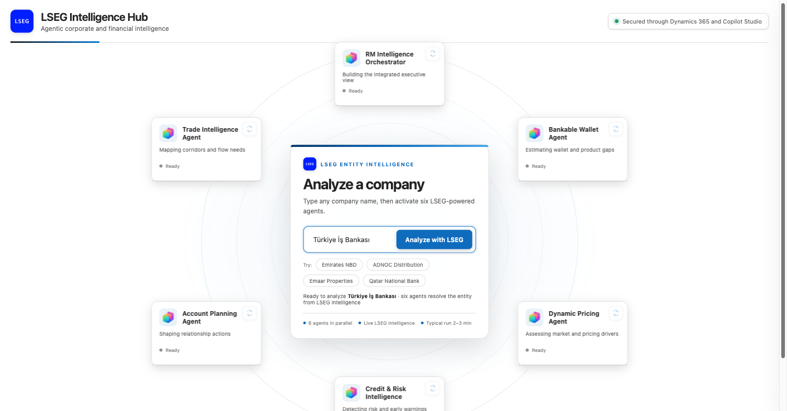
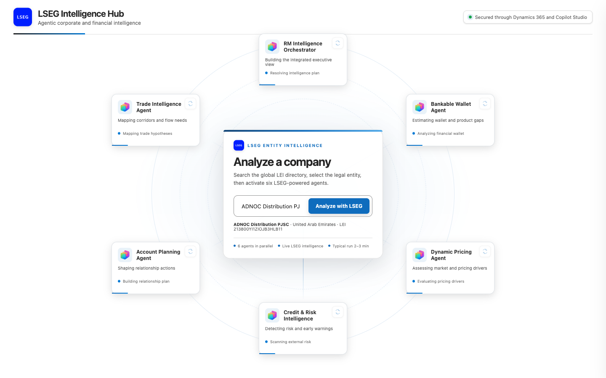
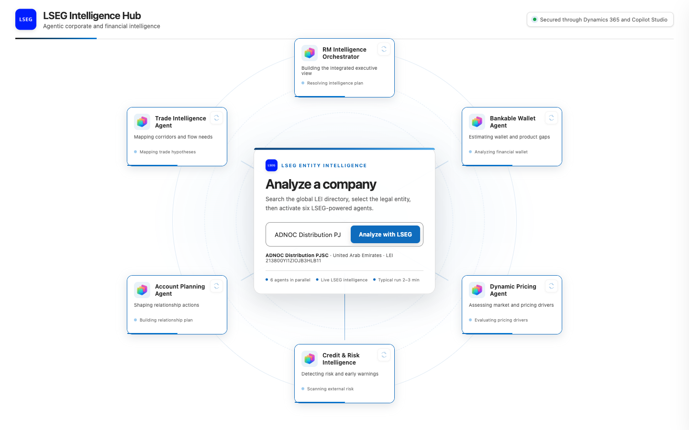
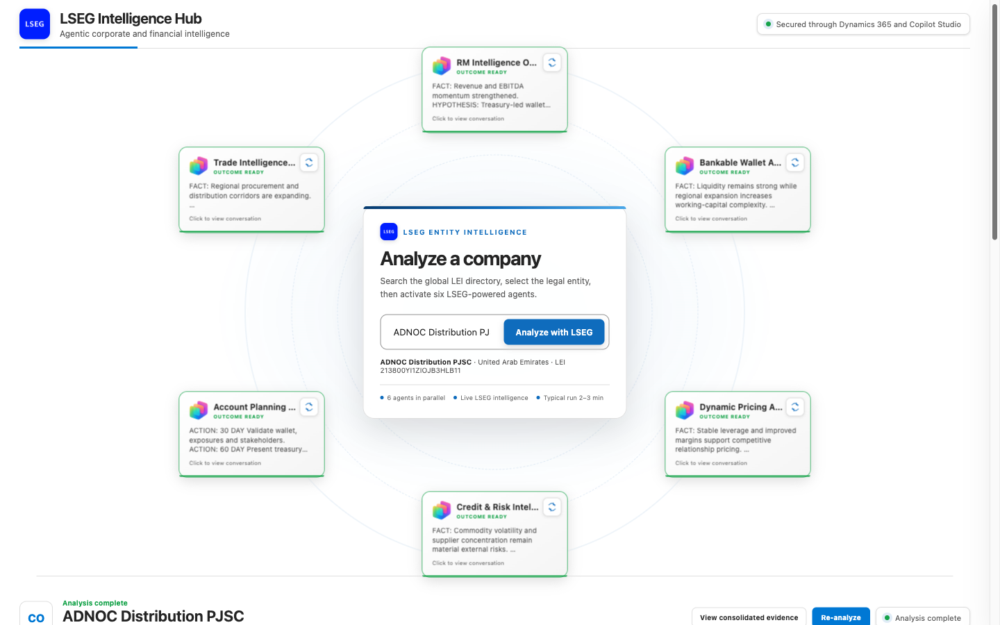
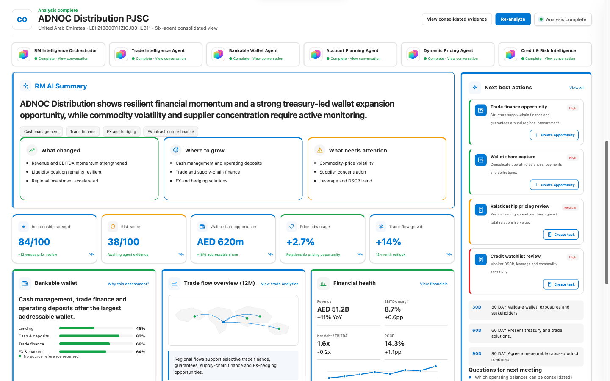
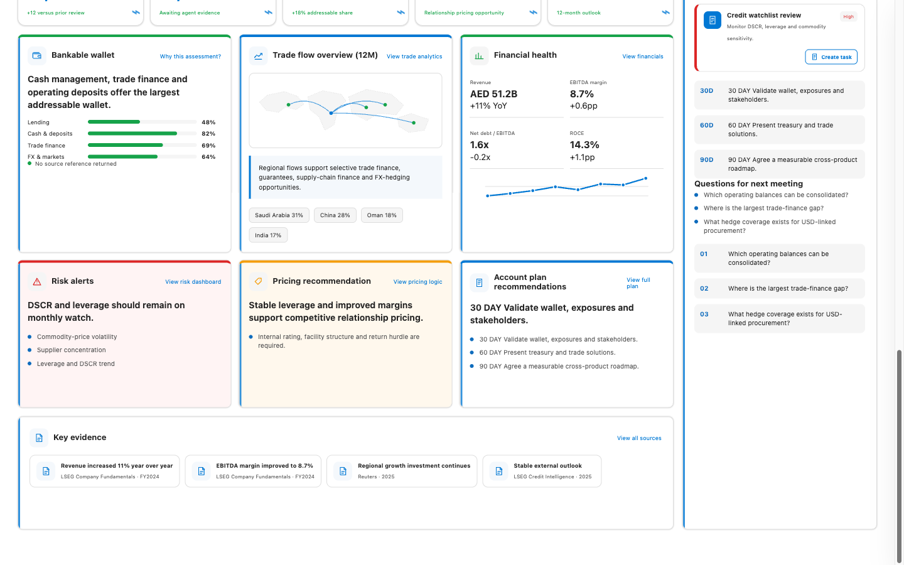
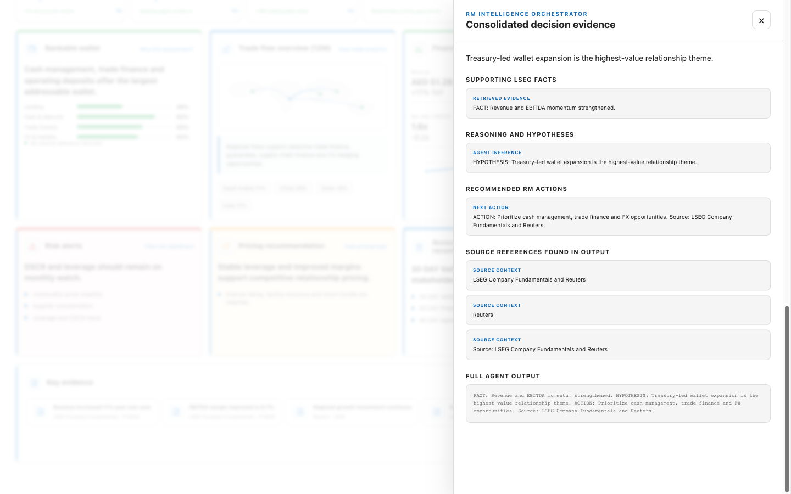
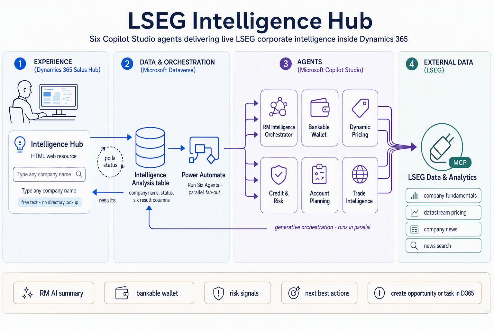
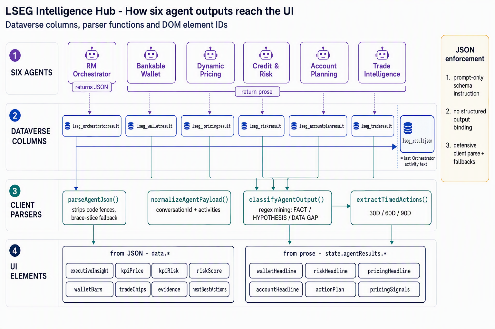

# LSEG Intelligence Hub

A multi-agent relationship-intelligence demo built on **Microsoft Copilot Studio**, **Power Automate**, and **Dataverse**, using the **LSEG Data & Analytics** MCP connector as its data source.

Type any company name and six specialised AI agents run in parallel against live LSEG market data, then an orchestrator fuses their findings into a single banker-ready view: bankable wallet, credit risk, dynamic pricing, trade intelligence, account plan, and recommended next best actions.



> [!WARNING]
> **Demo-grade software — use at your own risk.**
>
> This project is a **proof-of-concept demonstration**. It has **not** been hardened, security-reviewed, performance-tested, or validated for production use. It is provided **as-is, without warranty of any kind**.
>
> Do not deploy this to a production environment, or use it to make real lending, credit, pricing, or investment decisions, without conducting your own independent review, security assessment, and testing. AI-generated output in this demo is **not validated for accuracy** and may be incomplete or wrong — see [Known limitations](#known-limitations). Any use is entirely at your own risk, and you are solely responsible for the consequences.

> [!IMPORTANT]
> **Unofficial demo.** This is a personal technical demonstration. It is not a product, not supported, and not affiliated with or endorsed by London Stock Exchange Group plc or Microsoft Corporation. "LSEG" and related marks belong to their respective owners. No LSEG data, content, or credentials are included in this repository — you must supply your own licensed connection.

---

## What it does

| Agent | Question it answers |
|---|---|
| **Bankable Wallet** | What is the addressable banking wallet for this company? |
| **Credit Risk** | What is the credit and counterparty risk profile? |
| **Dynamic Pricing** | How should facilities be priced given the risk and market context? |
| **Trade Intelligence** | What trade-finance and supply-chain flows exist? |
| **Account Planning** | What is the relationship strategy and coverage plan? |
| **RM Orchestrator** | Fuses all of the above into a structured JSON verdict + next best actions. |

---

## Walkthrough

**1. Enter any company name.** Free text — no entity picker, no LEI lookup, no reference-data dependency.



**2. Six agents run in parallel.** Each one queries LSEG market data through its own MCP tool bindings.



**3. Outcomes are assembled.** The orchestrator fuses all six findings into a single structured verdict.



**4. Executive dashboard.** Bankable wallet, risk posture, pricing, and coverage strategy in one view.



**5. Deep insights and next best actions.** Concrete, time-bound recommendations for the relationship manager.



**6. Evidence and explainability.** Every claim traces back to the underlying LSEG data point that produced it.



---

## Architecture



The UI **never calls Power Automate directly.** It writes a Dataverse row and polls it:

```
intelligence-hub.html
      │  Xrm.WebApi.createRecord("lseg_intelligenceanalysis", { lseg_companyname })
      ▼
Dataverse row  ──(SubscribeWebhookTrigger, Create, org scope)──▶  Power Automate flow
                                                                        │
                                              parallel fan-out to 6 Copilot Studio agents
                                                                        │
                                                 each agent → LSEG Data & Analytics MCP tools
                                                                        │
      ┌─────────────────────────────────────────────────────────────────┘
      ▼
Flow writes lseg_resultjson + per-agent result columns back to the row
      │
      ▼
intelligence-hub.html polls via retrieveRecord every 2.5s and renders
```

This design means **no flow URL, HTTP trigger, or shared secret is ever exposed to the browser.** Dataverse row-level security governs who can start an analysis.

### Status codes

| Value | Meaning |
|---|---|
| `100000000` | Queued |
| `100000001` | Running |
| `100000002` | Completed |
| `100000003` | Failed |

### How agent output reaches the UI



Each agent's raw text is stored in its own column. `lseg_resultjson` carries the Orchestrator's structured JSON, which the client parses with `parseAgentJson()` — tolerant of code fences and leading model chatter. The five specialist agents return executive prose, which the client mines with `classifyAgentOutput()`.

---

## Repository layout

```
src/webresource/intelligence-hub.html   Single-file UI (HTML + CSS + JS, no build step)
src/webresource/rm-dashboard.html       RM portfolio overview dashboard (amCharts 5)
src/scripts/deploy_orchestration.py     Creates/updates the six-agent Power Automate flow
src/scripts/deploy_agents.py            Provisions the six Copilot Studio agents
src/scripts/deploy_hub_assets.py        Creates the lseg_intelligenceanalysis table + web resources
src/scripts/deploy_hub_app.py           Model-driven app registration
src/scripts/deploy_saleshub_navigation.py  Adds the hub to Sales Hub sitemap
src/scripts/dv.py                       Dataverse Web API helper (token + REST wrapper)
tools/                                  Diagram generators (Azure OpenAI image models)
solution/                               Packaged solution export v1.0.0.2 + import guide
docs/images/                            Architecture and UI images
```

> [!NOTE]
> The files under `src/webresource/` are exact copies of what ships in the v1.0.0.2 solution,
> so the source and the packaged export never drift apart.

---

## Getting started

The fastest path is to **import the solution** — see [`solution/`](solution/) for the packaged
export (v1.0.0.2) and import instructions. Alternatively, deploy from source with the scripts
below.

## Prerequisites

- A Power Platform environment with Dataverse
- **Copilot Studio** licensing
- A **licensed LSEG Data & Analytics** subscription and connector access
- Python 3.9+
- [Power Platform CLI (`pac`)](https://aka.ms/pac-cli), authenticated to your environment
- .NET runtime (required by `pac`)

---

## Setup

### 1. Configure environment variables

All tenant-specific values are read from the environment — nothing is hardcoded.

```bash
export DATAVERSE_URL="https://<yourorg>.crm.dynamics.com"
export POWER_PLATFORM_ENVIRONMENT_ID="<your-environment-guid>"
export LSEG_CONNECTION_ID="<your-lseg-connection-id>"

# Only needed if you want to regenerate the diagrams in tools/
export AZURE_OPENAI_IMAGE_ENDPOINT="https://<resource>.services.ai.azure.com/openai/v1/images/generations"
```

### 2. Authenticate

```bash
pac auth create --environment "$DATAVERSE_URL"
pac auth list          # confirm the right profile is selected
```

### 3. Deploy

Run in order — later steps depend on earlier ones:

```bash
python src/scripts/deploy_hub_assets.py      # table + web resources
python src/scripts/deploy_agents.py          # six Copilot Studio agents
python src/scripts/deploy_orchestration.py   # orchestration flow
python src/scripts/deploy_saleshub_navigation.py   # optional: Sales Hub nav
```

### 4. Connect LSEG

Open the [Power Platform connections page](https://make.powerapps.com/) and authenticate the **LSEG Data & Analytics** connection. Turn on the flow.

---

## Operational notes

These are real lessons from running this demo, not hypotheticals.

**The LSEG OAuth refresh token expires periodically.** When it does, the connection goes to `Unauthorized` with `invalid_grant`. Reconnect interactively in the maker portal.

**Expired connections fail silently — this is the single most important gotcha.** When Copilot Studio cannot enumerate the MCP tools, the planner quietly falls back to the built-in `UniversalSearchTool`, which returns `{"search_result": null}` in about 60 ms. The flow still writes `lseg_status = Completed`. **You get an empty report with a green status.**

To diagnose, inspect the run's `DynamicPlanReceived` → `value.steps`:

| Healthy | Broken |
|---|---|
| `MCP:<agent>.action.LSEG-...:<tool>` | `P:UniversalSearchTool` |

**`PublishAllXml` frequently times out** on this solution. Use a targeted `PublishXml` with the specific web resource GUID instead.

**Third-party calls from the browser.** For cosmetic company logos only, the UI calls
`autocomplete.clearbit.com`, `icons.duckduckgo.com`, and `google.com/s2/favicons`. These receive
the company name or domain being viewed. Remove these calls if that is unacceptable in your
environment — nothing else depends on them. The RM dashboard also loads **amCharts 5** from
`cdn.amcharts.com`; amCharts is commercially licensed for business use — review their
[licensing terms](https://www.amcharts.com/online-store/) before deploying it.

**`rm-dashboard.html` contains two hardcoded environment-specific GUIDs** that you must change
after import, or it will not work in your tenant:

| Location | Value | What to replace it with |
|---|---|---|
| `const APP_ID = "..."` | Sales Hub model-driven app ID | Your own app ID |
| `"customerid_account@odata.bind": "/accounts(...)"` | A demo account record | An account in your org |

---

## Known limitations

This is a demo, and it is honest about what it is not:

- **JSON output is requested, not enforced.** Only the Orchestrator prompt asks for strict JSON. The client parser is deliberately tolerant. There is no schema validation or retry.
- **Agents resolve the company name independently.** Because each agent resolves free text on its own, they can diverge on which legal entity they analysed when a name is ambiguous (e.g. a group with several listed subsidiaries). A resolve-first phase would fix this.
- **"No data" is not distinguished from "success."** See the silent-fallback note above.
- **The connector runs in Maker mode** — a single shared credential, so there is no per-user entitlement or audit trail. This is not appropriate for production use with licensed market data.

## Roadmap

- [ ] Per-agent enforced JSON schemas with validation and retry
- [ ] Three-phase orchestration: resolve entity → parallel fan-out → structured fan-in
- [ ] Fail-closed data gating so an empty result cannot report `Completed`
- [ ] Per-user entitlement instead of a shared Maker-mode connection
- [ ] Connection health monitoring with proactive alerting

---

## License

[MIT](LICENSE) — applies to the code in this repository only.

Market data, the LSEG connector, and Microsoft platform services are governed by their own separate licenses and are **not** granted by this repository.
